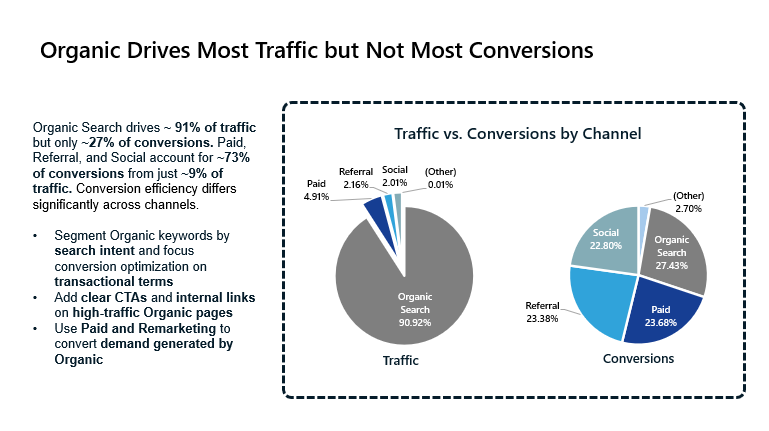
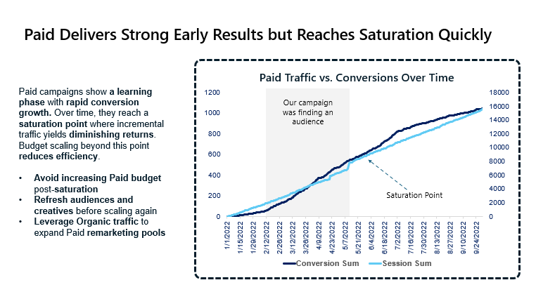
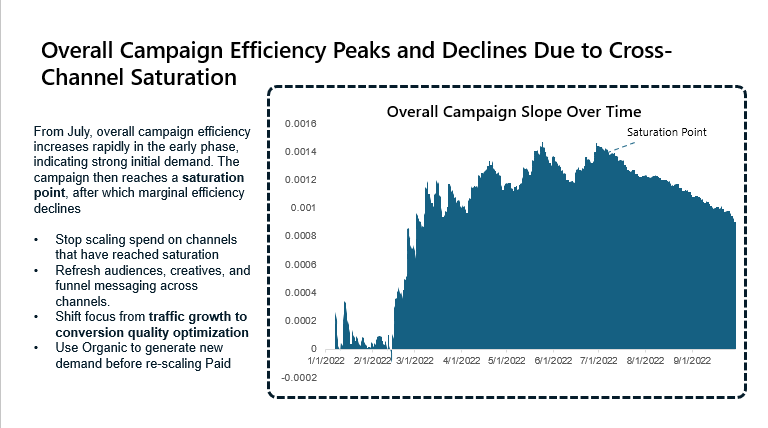
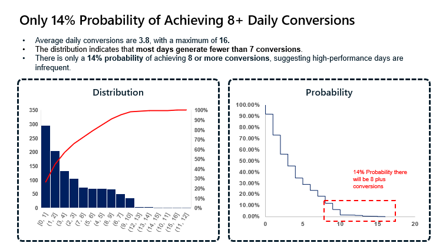

# Marketing Channel Performance Analysis
## 1. Project Objective
Provide an insight-driven analytical report to support data-driven marketing decisions by evaluating channel efficiency, saturation behavior, and conversion performance.

## 2. Dataset Used
- <a href="https://github.com/TranNgan2007/marketing-channel-performance-analysis/blob/main/Digital_Campaign.xlsx">Dateset</a>

## 3. Key Business Questions
- When did marketing performance reach saturation?
- Which channels or periods are overleveraged with diminishing returns?
- What actions can improve overall conversion efficiency?
- What is the probability of achieving high-conversion days (8+ conversions)?

## 4. Analysis Performed

### Channel Performance Analysis

Analyzed traffic volume and conversion distribution across Organic, Paid, Social, and Referral channels.

### Paid Campaign Trend Analysis

Evaluated Paid campaign performance over time to identify learning and saturation phases.

### Overall Campaign Efficiency

Assessed overall marketing efficiency trends across channels to detect diminishing returns.

### Conversion Probability Analysis

Analyzed daily conversion distribution to estimate probability of high-conversion days.

## 5. Final Recommendations
### Rebalance Organic Strategy
- Segment keywords by search intent
- Optimize conversions only for transactional terms
- Add CTAs and internal links on high-traffic pages

### Control Paid Post-Saturation
- Avoid budget scaling beyond saturation points
- Refresh audiences and creatives to reset learning
- Prioritize high-intent and remarketing traffic

### Align Organic → Paid
- Use Organic to generate demand
- Use Paid to convert demand

